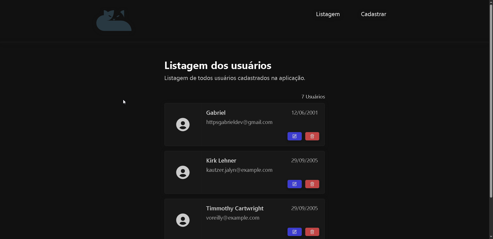
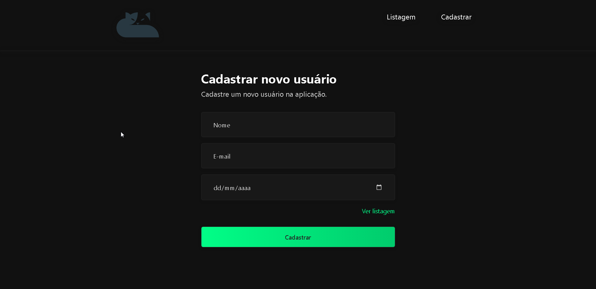

# API RESTful + CRUD (Laravel + React)

Este projeto é um CRUD completo com **backend em Laravel** e **frontend em React.js**, consumindo dados via **API RESTful** em formato JSON.

---

## 🚀 Tecnologias Utilizadas
- **Backend**
  - PHP 8+
  - Laravel
  - MySQL
  - Eloquent ORM
  - API RESTful com JSON
  - Testes de API com **Insomnia**

- **Frontend**
  - React.js (Vite)
  - Axios (requisições HTTP)
  - React Router DOM (rotas)
  - Toastify (notificações)
  - CSS Modules

---

## 📂 Estrutura de Pastas

│── apirest-backend/ API RESTful feita em Laravel
│── apirest-frontend/ CRUD feito em React.js


---

## 🔧 Como rodar o projeto

### Backend (Laravel)
```bash
cd apirest-backend
composer install
cp .env.example .env   # configure o banco de dados
php artisan key:generate
php artisan migrate --seed
php artisan serve


API rodando em: http://127.0.0.1:8000

Frontend (React)
cd apirest-frontend
npm install
npm run dev


Frontend rodando em: http://localhost:5173

📌 Funcionalidades

    Criar usuário

    Listar usuários

    Editar usuário

    Deletar usuário

    Feedback com Toastify

    Paginação de usuários


📱 Responsividade

    O projeto foi adaptado para desktop e mobile:

    No celular, os formulários e cards ocupam 100% da tela.

    No desktop, o layout é centralizado com largura fixa.

## 📷 Prints do Projeto

### 🔙 Backend (Laravel)


### 🔜 Frontend (React)



